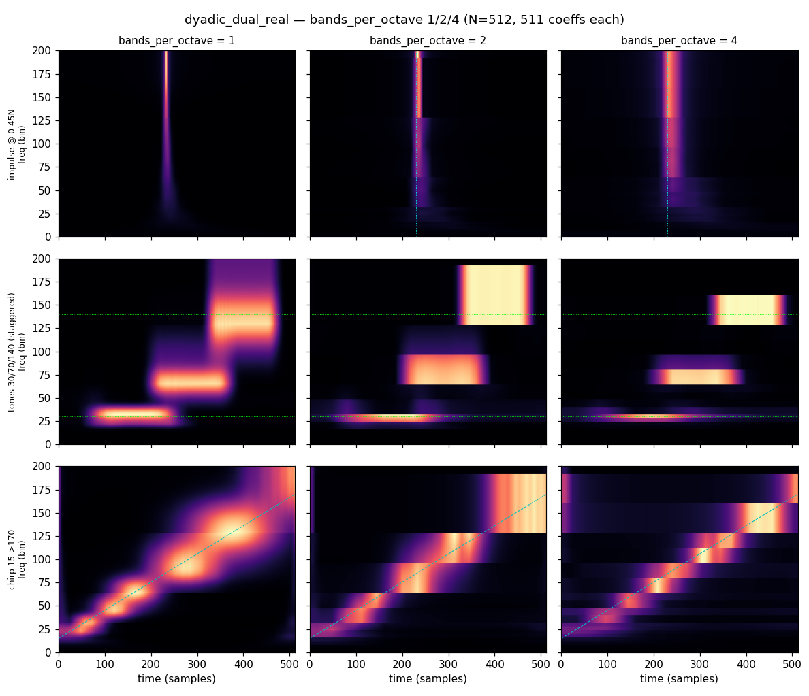

# gaussogram

A parsimonious, adaptive time–frequency representation — a fast **Gaussian
S-transform** (a member of the *General Fourier Family Transform*, GFT), with a
small Rust core and Python / MATLAB interfaces.

Like a short-time Fourier transform, it produces local frequency spectra; like a
wavelet transform, it gives **progressive (constant-Q) resolution** — trading
frequency resolution for time resolution as frequency rises, so high-frequency
events are localized more sharply in time. Crucially it is **parsimonious**: a
length-`N` signal is represented by `~N` coefficients in `O(N log N)`, instead of
the dense `N × N/2` grid of a full S-transform.

## Background & attribution

This is a from-scratch reimplementation of the fast, frequency-domain GFT
algorithm, taking the reference C/Python library
[**fst-uofc**](https://github.com/robince/fst-uofc) as its specification.

The algorithm is published in:

> R. A. Brown, M. L. Lauzon, and R. Frayne, *"A General Description of Linear
> Time-Frequency Transforms and Formulation of a Fast, Invertible Transform That
> Samples the Continuous S-Transform Spectrum Nonredundantly,"* IEEE
> Transactions on Signal Processing, **58**, 281–290, 2010.

If you publish work using the GFT, please cite that paper. The original library
is © UTI Limited Partnership (authors R. A. Brown, M. L. Lauzon, R. Frayne); see
the fst-uofc repository for its license terms.

## Transforms / schemes

The partition of the frequency axis is chosen by a `scheme`. The default fixes
the Gaussian "dead zones" at octave joins that the single dyadic cover suffers.

| scheme | input | output length | invertible | notes |
|---|---|---|---|---|
| `dyadic_dual_real` *(default)* | real | `N − 1` | no (redundant) | dyadic cover **plus** half-octave-offset bands centred on the octave joins, to rescue tones that fall into the single cover's dead zones |
| `dyadic_real` | real | `N/2 + 1` | **yes** | baseline single dyadic cover; the invertible, critically-sampled transform |
| `dyadic_complex` | complex | `N` | no | symmetric complex dyadic scheme (port of the legacy complex transform); min `N = 8` |

`N` must be a power of two. The Gaussian window is the default; a `box` window is
also available.

### Bands per octave

Both real schemes take a `bands_per_octave` option (a power of two: `1, 2, 4, …`,
default `1`) that subdivides each dyadic octave into that many frequency
sub-bands. This **rotates the time/frequency trade-off** — finer frequency
resolution, coarser time resolution — at a *constant* coefficient count: because
a band's width is both its frequency extent and its number of time samples,
splitting an octave conserves the total, so `dyadic_real` stays `N/2 + 1` and
`dyadic_dual_real` stays `N − 1` for **every** value. Subdivision keeps the
critically-sampled `dyadic_real` cover a disjoint integer partition, so it
remains exactly invertible. Running a few values (e.g. `1, 2, 4`) builds a
complementary multiresolution picture for far less data than a dense
`N × N/2` spectrogram.

The default `dyadic_dual_real` scheme (`N − 1 = 511` coefficients here) at
`bands_per_octave = 1, 2, 4` — an impulse, three staggered tones, and a chirp.
Every panel stores the signal in the **same 511 coefficients**; raising
`bands_per_octave` only trades time resolution for frequency resolution (the
impulse ridge widens; the tones and chirp sharpen in frequency):



See [`reports/bands_per_octave.md`](reports/bands_per_octave.md) for the full
write-up (including the invertible `dyadic_real` version).

## Install & quick start

Build the native extension (needs a Rust toolchain and
[maturin](https://www.maturin.rs/)):

```bash
maturin develop --release
```

```python
import numpy as np
import gaussogram as g

x = np.cos(2 * np.pi * 64 * np.arange(512) / 512)   # a tone

c = g.gft1d_real(x)                  # default dyadic_dual_real -> N-1 coeffs
grid = g.to_grid(c, len(x))          # (N/2+1, N) magnitude image for plotting

# Invertible scheme + round trip
coeffs = g.gft1d_real(x, scheme="dyadic_real")
recon = g.inverse_real(coeffs)       # ~exact

# Sub-octave resolution: 2 bands/octave, still N/2+1 coeffs, still invertible
fine = g.gft1d_real(x, scheme="dyadic_real", bands_per_octave=2)
recon2 = g.inverse_real(fine, bands_per_octave=2)   # ~exact

# Reusable handle (builds FFT plans + scratch once; best for tight loops)
h = g.Gaussogram1d(512, scheme="dyadic_real")
c = h.forward(x); xr = h.inverse(c)
```

### Python API

- `gft1d_real(x, scheme=…, window_type=…, nyquist_flat_top=…, bands_per_octave=…)` — forward GFT of a real signal.
- `gft1d(z, …)` — forward GFT of a complex signal (`dyadic_complex`).
- `inverse_real(coeffs, …, bands_per_octave=…)` — inverse of the invertible `dyadic_real` scheme (`bands_per_octave` must match the forward call).
- `Gaussogram1d(n, …, bands_per_octave=…)` — reusable engine handle (`.forward` / `.inverse`).
- `scheme_bands(n, …)` / `output_len(n, …)` — per-band geometry (`BandLayout`) and packed length.
- `partitions(n)` / `real_partitions(n)` — legacy partition boundaries.
- `to_grid(coeffs, n, …)` — render packed coefficients to a `(N/2+1, N)` image. Display options:
  - `interp` — time-axis resampling (`"linear"`, `"nearest"`).
  - `interp_freq` — frequency-axis placement (`"block"`, `"linear"`, `"gauss"`).
  - `normalize` — per-band brightness (`"none"`, `"width"` L1, `"energy"` L2).
  - `smooth` — optional Gaussian blur of the assembled grid.
- `coefficient_geometry(n, …)` / `coefficient_adjacency(n, …)` — **basis
  geometry for downstream models** (signal-independent). The first gives each
  coefficient's time-frequency tile (`time`, `freq`, `dt`, `df`, `level` octave
  index, `sub` within-octave rank, `tiling`, …) as positional features; the
  second gives a sparse neighbourhood
  graph (`time` / `band` / `dual` edges) for GNNs, graph-Laplacian smoothness, or
  structured-sparsity groups — letting a model use the packed ~N vector natively
  without densifying it to a grid. `to_sparse_adjacency(adj, n, …)` converts that
  graph to a sparse matrix for cluster-based statistics (MNE/FieldTrip
  permutation clustering, TFCE) or `scipy` connected components.

Inputs are validated strictly (1-D, C-contiguous, exact dtype) — no silent
copies/casts.

## Architecture

A Cargo workspace with one pure-Rust core and two thin interface crates:

```
crates/
  gaussogram-core/   pure Rust, no FFI, no NumPy — the algorithm
  gaussogram-py/     PyO3 + numpy bindings -> the `gaussogram._native` module
  gaussogram-ffi/    C ABI shim for MATLAB / other C callers
python/gaussogram/   NumPy-friendly wrappers (validation, to_grid display)
matlab/              MATLAB (.m) wrappers + MEX over the C ABI
```

### Core (`gaussogram-core`)

The design principle is **scheme-as-data**: a `Scheme` is just a list of `Band`s
(which spectrum slice maps to which output range) plus a parallel list of
`Window`s (per-band frequency-domain tapers). The `Gaussogram1d` engine walks
that data with **no per-scheme branching in the hot loop** — adding a scheme is a
data change, not new control flow.

- `scheme.rs` — `Band` / `Window` / `Scheme` and the scheme constructors.
- `window.rs` — frequency-domain Gaussian/box window screens.
- `engine.rs` — the transform engine; reusable `Scratch` (`alloc_scratch` +
  `forward_with` / `inverse_with`) so plans and buffers are built once and reused
  across calls; `forward_batch` for parallel batches.
- `fft.rs` — FFTs sit behind the `FftBackend` trait; the default backend is
  `rustfft` / `realfft` (feature `fft-rustfft`).
- `error.rs` — error type plus integer status codes shared with the C ABI.

### Interfaces

- **Python** (`gaussogram-py`, built with maturin as `gaussogram._native`):
  zero-copy NumPy access, releases the GIL during compute, exposes the free
  functions and the `Gaussogram1d` class. The user-facing wrappers live in
  `python/gaussogram/_api.py`.
- **C / MATLAB** (`gaussogram-ffi`): a C ABI shim that never lets a panic cross
  the boundary (`catch_unwind`) and reports errors as integer status codes; the
  MATLAB MEX and `.m` wrappers in `matlab/` call it.

## Repository layout

- `scripts/` — runnable demos (Jupyter `# %%` cell scripts): gaussograms of
  tones/chirps/impulses, interpolation and tiling illustrations, and
  `compare_existing.py`, which situates the transform against `pywt`, `dtcwt`,
  `nsgt`, and `ssqueezepy` (CWT / synchrosqueezing / STFT).
- `reports/` — a short write-up of the Python investigations (dead-zone fixes
  and a comparison against `pywt` / `dtcwt` / `nsgt` / `ssqueezepy`) with figures;
  regenerate via `python scripts/make_report.py`.
- `golden/` — golden vectors (generated from the reference) for parity tests.
- `extern/fst-uofc` — the reference library (a local checkout / symlink).
- `RUST_PORT_SPEC.md` — the porting specification.

## Tests

```bash
cargo test                                  # Rust core
maturin develop --release && pytest python  # Python
```

## License

**GPL-3.0** (with additional terms). gaussogram is a derivative work — a Rust
port — of [fst-uofc](https://github.com/robince/fst-uofc), which is GPL-3.0 with
§7 additional terms (attribution, warranty/liability disclaimers, no-trademark,
indemnification). Because the original is GPL-3.0, this port is too; the upstream
copyright and additional terms are retained. See [`LICENSE`](LICENSE) for the GPL
text and [`NOTICE`](NOTICE) for the attribution and additional terms.

Upstream FST is © 2010 UTI Limited Partnership (original authors: R. A. Brown,
M. L. Lauzon, R. Frayne). A non-free license is available separately from UTI.
