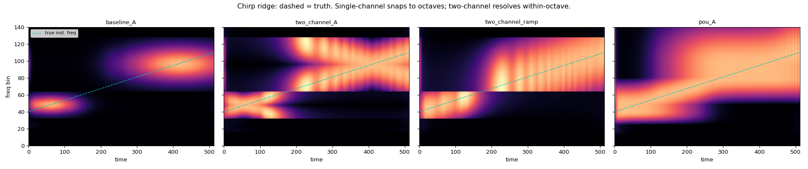
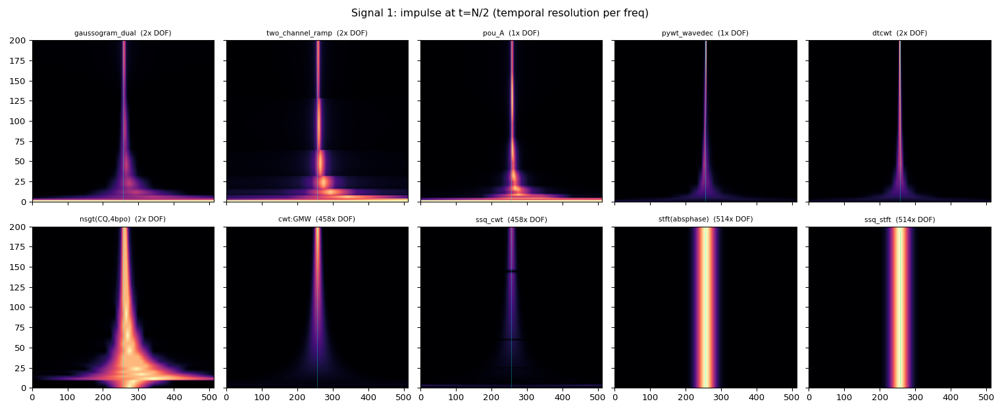
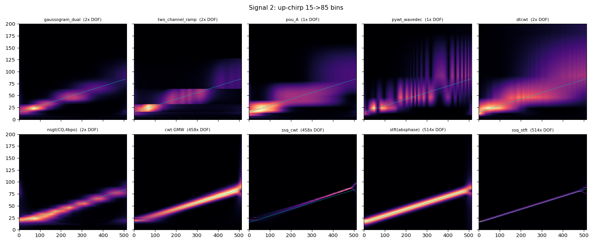
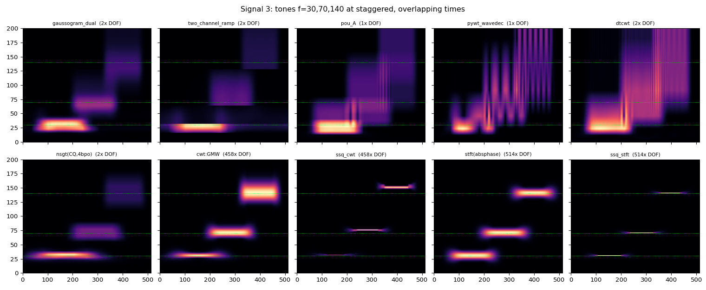

# Time–frequency investigations

A short report collecting the Python experiments behind gaussogram's design
choices: (1) how the default scheme fixes the octave-join "dead zone", and
(2) how the transform sits relative to standard off-the-shelf time–frequency
transforms.

See also [**bands_per_octave.md**](bands_per_octave.md) — a focused report on the
`bands_per_octave` option (sub-octave resolution at constant coefficient count),
with impulse / tones / chirp examples on the dual scheme.

Reproduce everything (figures + tables) with:

```bash
python scripts/make_report.py     # needs the dev deps: pywt, ssqueezepy, scipy, nsgt, dtcwt
```

All results use `N = 512` and are **illustrative** — ridge-tracking numbers in
particular depend on the test signal and the display normalisation, so compare
*within* a table, not across.

---

## 1. Fixing the octave-join dead zone

A single dyadic cover (`dyadic_real`) puts one centred Gaussian per octave, so a
tone landing exactly on an octave **join** falls into both neighbours' window
tails and is strongly attenuated. We prototyped fixes that keep tiling A's clean,
regular grid (`scripts/prototype_edge_schemes.py`):

- **`baseline_A`** — `dyadic_real`: one centred Gaussian per octave.
- **`two_channel_A`** — add an *edge* window per band (centre + edge,
  power-complementary). Captures the join, but the edge channel peaks at *both*
  joins → ambiguous.
- **`two_channel_ramp`** — a monotonic *low/high* `cos`/`sin` pair per octave
  (a Wilson-/dual-tree-style construction). No ambiguity.
- **`pou_A`** — one channel per octave but with overlapping partition-of-unity
  windows that cross-fade at the joins.

| scheme | coeffs | recon error | join/centre energy | chirp ridge MAE (40→110) |
|---|---:|---:|---:|---:|
| `baseline_A` | 257 | 1.8e-15 | **0.006** (dead zone) | 12.17 |
| `two_channel_A` | 514 | 1.2e-15 | 0.500 | 6.86 |
| **`two_channel_ramp`** | 514 | 1.2e-15 | 0.500 | **0.88** |
| `pou_A` | 383 | 1.3e-15 | 0.750 | 2.04 |

All reconstruct exactly. `baseline_A` collapses at the join (0.6% of the centre
energy); every fix restores it. The monotonic **ramp** tracks a chirp best; the
**centre/edge** variant ghosts because its edge window can't tell the lower join
from the upper one:



This is the same instinct behind the production default `dyadic_dual_real`
(offset bands centred on the joins), and behind the `to_grid(interp_freq="gauss")`
display mode that confines each band to its effective bandwidth.

---

## 2. Situating against off-the-shelf transforms

`scripts/compare_existing.py` runs the same signals through our schemes and
through `pywt` (dyadic wavelet), `dtcwt` (dual-tree complex wavelet), `nsgt`
(nonstationary Gabor / invertible constant-Q), and `ssqueezepy` (GMW CWT,
synchrosqueezing, and STFT). Coefficients are complex (2 real numbers each,
carrying phase) except pywt's real DWT, so parsimony is compared in **real DOF**:

| method | real DOF | redundancy | regime |
|---|---:|---:|---|
| `pywt_wavedec` | 512 | **1.0×** | true critical sampling |
| `pou_A` (ours) | 766 | 1.5× | low-redundancy constant-Q |
| `gaussogram_dual` / `two_channel_ramp` (ours) | ~1020 | 2.0× | low-redundancy constant-Q |
| `dtcwt` | 1020 | 2.0× | constant-Q complex |
| `nsgt` (4 bpo) | 1054 | 2.1× | constant-Q complex |
| `cwt:GMW` / `ssq_cwt` | 234 496 | 458× | dense / reassigned |
| `stft` / `ssq_stft` | 263 168 | 514× | dense / reassigned |

**Three regimes:** 1× parsimony (pywt), ~1.5–2× low-redundancy constant-Q (ours,
nsgt, dtcwt), and 450×+ dense (CWT/STFT/synchrosqueezing).

### Temporal resolution — impulse at the centre

An impulse is flat in frequency, so each panel's vertical ridge widens where its
time resolution is poor. Constant-Q transforms show the classic cone (sharp at
high frequency, wide at low); the STFT shows a uniform band.



Temporal width (FWHM, samples; **lower = better time isolation**):

| method | @bin40 | @bin100 | @bin180 |
|---|---:|---:|---:|
| `pywt` / `dtcwt` | 16 / 17 | 6 / 7 | **2 / 3** |
| `pou_A` | 13 | 7 | 7 |
| `two_channel_ramp` | 23 | 12 | 10 |
| `gaussogram_dual` | 28 | 13 | 8 |
| **`nsgt` (4 bpo)** | **89** | **33** | **18** |
| `cwt:GMW` | 65 | 25 | 15 |
| `stft` | 43 | 43 | 43 (uniform) |

The wavelets and our schemes have the tightest time isolation; **nsgt has the
worst** — it bought its finer frequency look (4 bins/octave) by spending time
resolution (Heisenberg). All constant-Q methods get sharper in time as frequency
rises, exactly as intended.

### Frequency tracking — chirps and tones



Down-chirp (15→85) ridge MAE (bins, lower = better):

| method | MAE | | method | MAE |
|---|---:|---|---|---:|
| `stft` | 0.25 | | `nsgt` | 3.04 |
| `cwt:GMW` | 0.42 | | `gaussogram_dual` | 4.60 |
| `two_channel_ramp` | 1.48 | | `pou_A` | 4.82 |
| `ssq_cwt` | 3.34 | | `dtcwt` | 9.86 |
| `ssq_stft` | 0.28 | | `pywt` | 12.23 |



### Takeaways

- **pywt** (1× DOF) is the parsimony champion but is octave-blocky, shift-variant
  (the striping), and mislocates an octave-join tone — a compression tool, not a
  display.
- **nsgt** looks the sharpest in frequency (4 bpo) but has the worst time
  isolation; it's the opposite tradeoff to ours.
- **ours** sit in the balanced middle: ~2× DOF, good time isolation, clean join
  handling, and the only ones carrying the S-transform's absolute phase.
- **`gaussogram_dual`'s** apparent edge in earlier single-signal tests was partly
  because a tone on bin 64 sits exactly on one of its offset bands; on the
  down-chirp (no such coincidence) `two_channel_ramp` is clearly better.
- **CWT/STFT/synchrosqueezing** give the cleanest pictures but at 450×+
  redundancy.

**bpo and DOF.** More bins-per-octave is *free in coefficient count* (narrower
bands need proportionally fewer time samples), so it costs **time** resolution,
not storage. `gaussogram_dual` ≈ 2 bpo; nsgt here = 4 bpo — same DOF, finer
frequency, blurrier time.

---

## 3. Display normalisation

A line of fixed amplitude gives `|coeff| ∝ 1/width`, but a flat-spectrum event
(impulse/noise) gives `|coeff| ∝ const`. So no single per-band normalisation is
flat for both — the classic L1-vs-L2 wavelet trade, exposed by `to_grid`'s
`normalize` option:

- `"none"` — flat for impulse/noise, tones dim at high frequency.
- `"width"` (L1) — flat for tones, impulse tilts up ∝ width.
- `"energy"` (L2, ×√width) — the balanced middle.

The cross-transform figures above use raw (`"none"`) consistently, so the impulse
stays flat across every panel. (`pywt`/`dtcwt`/`cwt` still tilt because of their
*own* internal normalisation conventions.)

---

*Figures regenerated by `scripts/make_report.py`; underlying code in
`scripts/prototype_edge_schemes.py` and `scripts/compare_existing.py`.*
