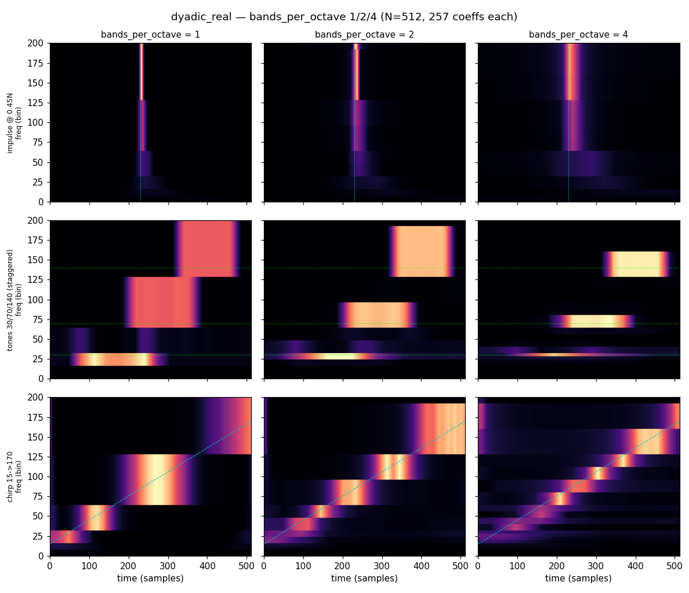

# Bands per octave

A short report on the `bands_per_octave` option for the real schemes: what it
does, why it is *free* in coefficient count, and how it looks on an impulse,
three staggered tones, and a chirp. All results use `N = 512`.

Reproduce the figures with:

```bash
python scripts/compare_bands_per_octave.py     # needs only gaussogram + matplotlib
```

---

## What it does

The baseline schemes put **one Gaussian band per octave** (a dyadic cover).
`bands_per_octave = K` (a power of two: `1, 2, 4, …`) subdivides each octave into
`K` equal frequency sub-bands, giving finer frequency resolution at the cost of
coarser time resolution — the constant-Q knob.

The key property is that this is **free in storage**. A band's `width` does double
duty: it is both the band's frequency extent (in bins) *and* its number of output
time samples (the inverse FFT of `width` bins gives `width` points). Splitting an
octave of width `W` into `K` sub-bands of width `W/K` therefore conserves the
total: `K × (W/K) = W`. So the output length is **invariant** to `bands_per_octave`:

| scheme | output length | for every `bands_per_octave` |
|---|---:|---|
| `dyadic_real` | `N/2 + 1` = **257** | invertible, critically sampled |
| `dyadic_dual_real` | `N − 1` = **511** | ~2× redundant default (fills dead zones) |

`bands_per_octave` only rotates the time/frequency trade-off; it is the
*single-vs-dual* choice, not `bands_per_octave`, that changes the coefficient
count. Concretely, for `dyadic_dual_real` (N=512) the bands redistribute but the
511 coefficients do not:

| `bpo` | n_bands | band @bin96: `df` (bins) | `dt` (samples) |
|---:|---:|---:|---:|
| 1 | 16 | 64 | 8 |
| 2 | 29 | 32 | 16 |
| 4 | 51 | 16 | 32 |

Frequency extent halves and time extent doubles at each step, in lockstep.

The dual scheme's tiling B (the dead-zone cover) is subdivided in lockstep with
tiling A but kept **offset by half a sub-band**, so each B band centres on a
tiling-A *join* (the weak point) rather than coinciding with an A sub-band. That
offset is what lets a tone falling between two band centres be triangulated into a
focused peak at every `bands_per_octave` (a naive subdivision that let B and A
coincide would instead render such a tone as a flat block).

---

## The pictures — dual scheme (511 coeffs each)

`dyadic_dual_real`, rendered with `to_grid(interp_freq="gauss", normalize="width")`.
Rows are signals; columns are `bands_per_octave = 1, 2, 4`.


Read each row left→right:

- **Impulse** (top, at `0.45 N`): the ridge *widens in time* as `bpo` rises — the
  high-frequency block goes from a sharp line to a fat block. This is the cost:
  time resolution traded away. The widening is strongest at low frequency, where
  bands are already narrow (few time samples).
- **Three tones** (middle): the opposite payoff — each tone collapses from a tall
  octave-wide blob toward its true frequency line (dotted 30/70/140), sharpening
  in frequency.
- **Chirp** (bottom, 15→170): the diagonal goes from a coarse octave staircase to
  a finely stratified sweep that hugs the instantaneous-frequency line (dashed)
  much more tightly — at the price of wider time tiles.

The trade-off rotates cleanly in both directions, at constant 511-coefficient cost.
At `bpo = 4` the constant-Q compactness is comparable to a 4-bins/octave nsgt, but
the underlying transform stays parsimonious and (for `dyadic_real`) exactly
invertible — a far leaner basis than a dense CWT.

---

## Why the dual scheme shows blobs and the single cover shows blocks

The same three signals on `dyadic_real` (257 coeffs each) render the tones as flat
octave **blocks**, not Gaussian blobs:



This is **not** an interpolation difference — both figures use
`interp_freq="gauss"`. The `"gauss"` mode weights each band's time-row by its
Gaussian window across frequency and then normalises across overlapping bands
(partition of unity). On a **single, non-overlapping** tiling (`dyadic_real`) every
frequency bin is covered by exactly one band, so the normalisation cancels the
Gaussian exactly and each band paints a flat block over its octave — `"gauss"`
degenerates to `"block"`. The **overlapping** dual tiling (A + half-octave-offset
B) covers each bin with several bands of different weights and time-rows, so the
normalised blend forms a compact peak confined to the effective bandwidth. The
dead-zone-filling redundancy of the dual scheme is exactly what lets the display
confine energy to a blob. (For compact peaks on the single cover, use
`interp_freq="linear"`, which anchors each band at its centre and interpolates.)

---

## Two caveats worth knowing

**Low-frequency time placement (display).** `to_grid` anchors each band's `width`
samples at their time-cell **centres** `(j+0.5)·N/width`, matching
`coefficient_geometry`. This matters for narrow (low-frequency / high-`bpo`) bands:
an earlier endpoint convention pushed a width-2 band's two samples onto `t=0` and
`t=N−1`, biasing a centred impulse's energy toward the right edge. The residual
coarseness that remains at the very lowest bands is genuine — a width-2 band has
only two time cells spanning the whole record, so it physically cannot localise
better; `bpo = 4` makes that worse by splitting low octaves into such narrow bands.

**Chirp power at `t ≈ 0` (signal, not transform).** The chirp 15→170 is not
periodic: its end (instantaneous frequency ~170) does not join smoothly back to its
start, leaving a step discontinuity where `t = N` wraps to `t = 0`. Every FFT-based
transform is inherently circular, so that seam acts like a broadband transient
pinned at `t ≈ 0`, most visible in the wide high-frequency bands. Tapering the chirp
ends (forcing periodicity) collapses the `t ≈ 0` high-frequency power by ~25× and the
artefact disappears — it is classic spectral leakage from the non-periodic boundary,
unrelated to `bands_per_octave`.

---

*Figures generated by `scripts/compare_bands_per_octave.py`.*
